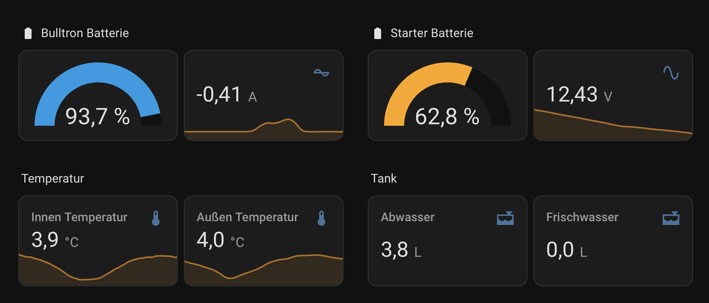

# Simarine to Home Assistant via ESP

An esp-idf app for sending sensor values from Simarine devices to Home Assistant via MQTT.
Used to remotely monitor your van or boat from your Home Assisant instance at home with minimal energy consumption.

Based on the fantastic reverse engineering work of https://github.com/htool/pico2signalk

Tested with Simarine Pico rev2 and firmware 1.17

## Setup

- Optional: Verify that the library can handle your Simarine setup by building and running an example app in https://github.com/christopher-strack/spymarine-cpp
- Setup an external MQTT broker (for example http://hivemq.com)
- Setup the MQTT integration in Home Assistant and connect to the external broker
- Copy `src/config.example.hpp` to `src/config.hpp` and enter you Wifi password and your MQTT broker credentials
- Build and flash an ESP32 with [esp-idf](https://docs.espressif.com/projects/esp-idf/en/stable/esp32/get-started/index.html)
- Set your Simarine device to STA mode and connect it to the same Wifi network as the ESP32
- Power and start the ESP32
- That's it. The ESP32 uses device discovery to expose each Simarine device to Home Assistant.

## Known Issues

- Only tested with my own personal Simarine setup
- Non-ASCII characters in device names will not be represented correctly and replaced with a
  placeholder. A non-standard encoding seems to be used.

## Contributing

Contributions are welcome! Please open an issue or submit a pull request on GitHub.

## References

See https://github.com/christopher-strack/spymarine-cpp for the C++
library that powers the application.

See https://github.com/christopher-strack/spymarine for a Python
library to read Simarine sensor values

## Author

Christopher Strack
